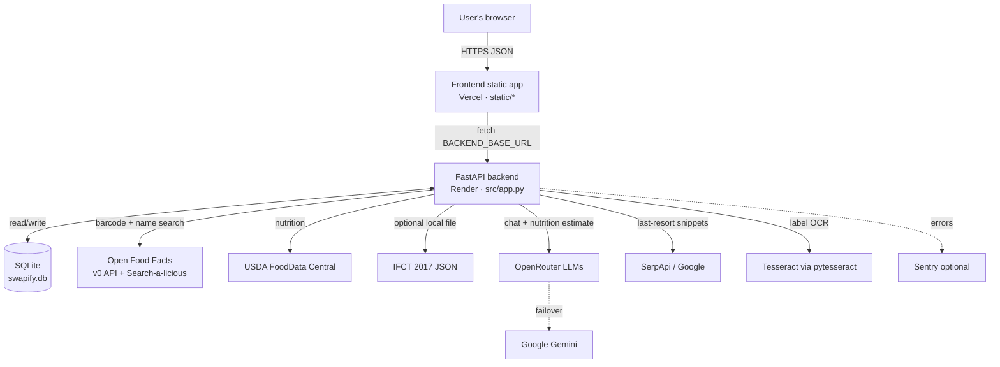
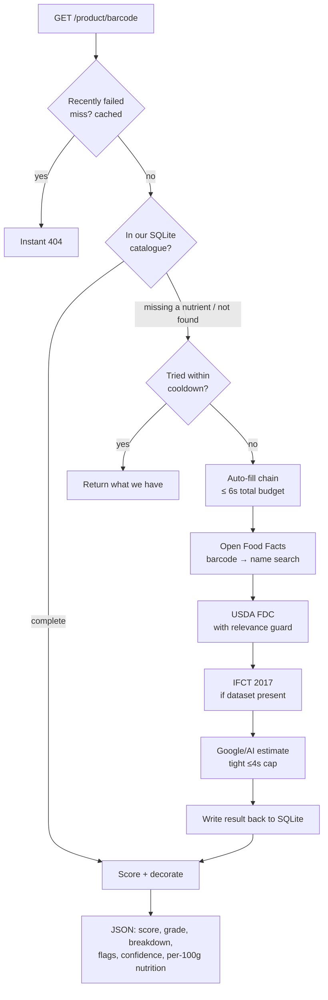

# Swapify — Architecture Overview

This is the "what talks to what" map. For endpoint-level detail see
[API_DOCS.md](API_DOCS.md); for the data model see
[DATABASE_SCHEMA.md](DATABASE_SCHEMA.md).

## The shape of it, in one paragraph

A **static frontend** (plain HTML/CSS/JS, hosted on Vercel) makes HTTPS calls to a
**FastAPI backend** (a single Python process on Render). The backend reads and
writes a **SQLite database** that is the source of truth for the product
catalogue, users, scans, and everything social. When a scanned product is missing
from the database, the backend reaches out — in a strict, time-budgeted order — to
**Open Food Facts, USDA, an optional local IFCT dataset, and finally an AI/Google
"safety net"**, then writes whatever it learns back into SQLite so the next scan is
local. The **AI nutritionist chat** and the last-resort nutrition estimate call
out to **OpenRouter** (with **Google Gemini** as failover). An optional **OCR**
module reads printed labels with Tesseract. Nothing except the database is
required for the app to boot — every external dependency degrades gracefully.



---

## Components

### 1. Frontend — `static/`
Plain static files, **no build step**: `index.html`, `style.css`, `script.js`, and
`swapify_products.csv` (an offline mirror of the catalogue). It is deployed as-is
to Vercel and talks to the backend over HTTPS.

- The backend base URL is a single constant at the top of `script.js`
  (`BACKEND_OVERRIDE_URL = 'https://swapify-3.onrender.com'`); every API call is
  built from it.
- The browser keeps a **client-side copy of the catalogue** (`csvDB`, loaded from
  `swapify_products.csv`) and a **client-side port of the scoring engine**
  (`calculateScore`) so it can still show scores when the backend is unreachable
  or for offline list/category cards. The scanner path always prefers the
  backend's score. (This dual scorer is the source of a documented divergence —
  see [KNOWN_ISSUES.md](KNOWN_ISSUES.md).)

### 2. Backend — `src/app.py`
The whole API is one FastAPI application (~90 routes) in a single file, plus three
small sibling modules:

| Module | Role |
|--------|------|
| `src/app.py` | All routes, auth, scoring, product resolution, caching |
| `src/category_taxonomy.py` | The one place that maps a product to a category (used by seeding, `/similar`, recommendations) |
| `src/ocr_label_scanner.py` | OCR label reader (lazy, optional) |
| `src/observability.py` | Sentry init + request context (optional, can never crash the app) |

It runs behind **gunicorn + uvicorn workers** in production and plain uvicorn
locally. Only one static path is mounted by the backend: `/product-images`
(crowd-uploaded product photos). The frontend itself is **not** served by the
backend — it's a separate Vercel deployment.

### 3. Database — `swapify.db` (SQLite, WAL mode)
The single source of truth. 25 tables: the product catalogue, users + auth,
scan history, favourites, ratings, reviews, shopping lists, challenges, the
scoring-rule tables, and more. Every connection opts into **WAL** (readers never
block the writer) with a busy-timeout. Paths come from env vars
(`SWAPIFY_DB_PATH`, `SWAPIFY_CSV_PATH`) — no developer paths are hard-coded.
Details in [DATABASE_SCHEMA.md](DATABASE_SCHEMA.md).

---

## Core request flow: scanning a product

`GET /product/{barcode}` is the heart of the app. Resolution is **database-first**,
then a **time-budgeted fallback chain**:



Key properties (all in `resolve_raw_product` / `_run_autofill_chain`):

- **Database first.** A product we curate never triggers a network call.
- **One wall-clock budget** (`SWAPIFY_AUTOFILL_BUDGET`, 6s) bounds the *whole*
  chain; each source gets `min(its timeout, budget left)`. The slow AI estimate is
  capped separately (4s). A scan can't hang for 20s+ on a slow source.
- **Caches** (in-process `TTLCache`): resolved products (1h), "not found anywhere"
  misses (10 min → instant 404 on rescan), and an "already attempted enrichment"
  cooldown (10 min → a partially-filled product isn't re-fetched every scan).
- **Relevance guard** on name-based matches, so a loose fuzzy match can't inject
  an unrelated product's nutrition.
- **Write-back.** Anything a fallback fills is normalised to per-100g and UPSERTed
  into `products` (the DB stays source of truth; existing values are never
  overwritten).

### The scoring engine
`calculate_health_score_v2()` turns a per-100g product into a 1–10 score, letter
grade, and a full breakdown (base score, nutrient penalties, ingredient
penalties/bonuses, category caps, transparency multiplier). It implements
[`ScoringLogic_Swapify.md`](ScoringLogic_Swapify.md) and is locked down by
[`test_scoring_spec.py`](test_scoring_spec.py) (100 assertions). Ingredient **risk
levels** are read from the `ingredient_rules` DB table; the rest of the rule
weights are currently in-code constants (see [KNOWN_ISSUES.md](KNOWN_ISSUES.md)).

---

## Where OpenRouter / Gemini fit

Two independent AI touchpoints, both optional and both with deterministic
fallbacks:

1. **AI nutritionist chat (`POST /chat`).** Answers free-text questions grounded
   in the resolved product's own data. Provider order: **OpenRouter** (primary,
   many free-tier models tried in turn) → **Google Gemini** (failover). A single
   per-request wall-clock **budget** bounds the whole provider chain. Fast-paths
   short-circuit the LLM entirely: a bare greeting is answered instantly, and a
   plain "score of X / is X healthy" is answered deterministically from our scored
   data (`source: "fast-path-deterministic"`). If every provider fails or no key
   is set, a structured **rule-based food-science fallback** answers instead — the
   endpoint always responds.

2. **AI nutrition estimate (auto-fill safety net).** The last link in the
   resolution chain. When Open Food Facts / USDA / IFCT can't fill a product and a
   `SERPAPI_KEY` isn't set, the backend asks the LLM for typical per-100g nutrition
   as strict JSON, capped at a tight timeout and flagged as an *estimate* (which
   caps the product's confidence). In practice free models are unreliable here —
   see [KNOWN_ISSUES.md](KNOWN_ISSUES.md).

Keys: `OPENROUTER_API_KEY` (+ `OPENROUTER_MODEL`, `OPENROUTER_FALLBACK_MODELS`),
`GEMINI_API_KEY` (+ `GEMINI_MODEL`). None set → chat uses the rule-based fallback,
and the AI estimate is skipped.

---

## How OCR is wired in

The OCR label scanner is a **proof-of-concept, fully decoupled** feature:

- `src/ocr_label_scanner.py` uses **Tesseract** (via `pytesseract` + `Pillow`) to
  read a photographed label, then parses out the ingredient list and any nutrition
  numbers.
- The heavy imports are **lazy**: the module imports safely even when Tesseract or
  Pillow aren't installed. `GET /ocr/health` reports availability; `POST
  /ocr/scan-label` extracts text, then scores it through the *same*
  `calculate_health_score_v2` engine as everything else.
- If the OCR stack is absent, the `/ocr/*` endpoints return a clean "OCR
  unavailable" response and the rest of the app is unaffected. Tesseract is a
  **native** dependency (a separate OS-level install), not a pip package.

---

## External services at a glance

| Service | Used for | Key | If unavailable |
|---------|----------|-----|----------------|
| **Open Food Facts** | Barcode lookup + name/category search (global catalogue) | none | Product just isn't found externally |
| **USDA FoodData Central** | Nutrition by name/barcode in auto-fill | `USDA_API_KEY` (`DEMO_KEY` default) | Source skipped |
| **IFCT 2017** | Indian-foods nutrition (local JSON) | `IFCT_DATA_PATH` | Skipped (not bundled) |
| **OpenRouter** | AI chat + AI nutrition estimate | `OPENROUTER_API_KEY` | Rule-based fallback |
| **Google Gemini** | AI failover | `GEMINI_API_KEY` | Skipped |
| **SerpApi** | Structured Google results for the safety net | `SERPAPI_KEY` | Falls back to AI estimate |
| **Sentry** | Error tracking | `SENTRY_DSN` | No-op |

---

## Cross-cutting concerns

- **Auth:** email/password with bcrypt hashing; a JWT (`HS256`, signed with
  `SECRET_KEY`) is returned on login and sent as `Authorization: Bearer …`. Most
  read endpoints accept optional auth (personalises results); writes require it.
- **Caching:** per-process `cachetools.TTLCache` for scored products, popular
  products, the autocomplete index, external-search results, and the
  resolution/enrichment guards. Counters are exposed at `/cache-stats`. These are
  **per-worker** and reset on restart (see [KNOWN_ISSUES.md](KNOWN_ISSUES.md)).
- **CORS:** configurable via `CORS_ORIGINS` (defaults to `*` for local dev; set the
  real frontend origin in production). A regex also allows mobile-shell origins.
- **Compression:** gzip for responses over ~500 bytes.
- **Observability:** Sentry is initialised only if `SENTRY_DSN` is set, and is
  written so it can never take the app down.

---

## Deployment topology

```
Vercel (static frontend)  ──HTTPS──▶  Render (FastAPI + gunicorn/uvicorn)  ──▶  SQLite on disk
     swapify-three.vercel.app              swapify-3.onrender.com
```

The whole point of the Render setup is that it runs independently of any personal
machine — the process is respawned automatically and `GET /health` reports an
uptime that keeps climbing across laptop shutdowns. See
[DEPLOYMENT.md](DEPLOYMENT.md) for the exact configuration.
