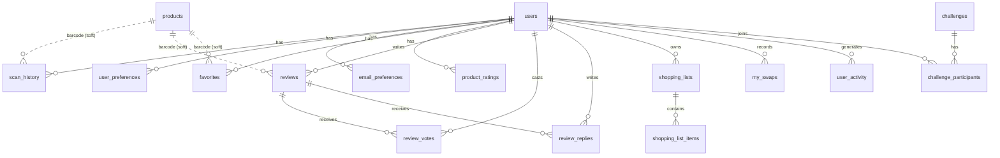

# Swapify — Database Schema

The backend uses a single **SQLite** database (`swapify.db`, WAL mode). It is the
source of truth for everything; `products.csv` only seeds/syncs the catalogue. The
schema is created and migrated automatically at startup (`ensure_*` functions in
`src/app.py`) — there is no separate migration tool. There are **25 tables**.

Two conventions to know up front:

- **`barcode` is a soft link, not a foreign key.** Product-referencing tables
  (`scan_history`, `favorites`, `reviews`, …) store a `barcode` TEXT column but do
  **not** declare a FK to `products`. That's deliberate: a scanned/rated barcode
  may come from Open Food Facts and not exist in our own catalogue.
- **`user_id` foreign keys** point to `users(id)`. (SQLite only enforces FKs when
  `PRAGMA foreign_keys=ON`; treat them as the intended relationships.)

Row counts below are "as shipped" in the committed `swapify.db` and are just
context — most are live/runtime data.



---

## 1. Product catalogue & scoring rules

### `products` (252 rows) — the catalogue · **PK `barcode`**
Nutrition is stored **per 100 g** (`serving_size_g = 100`); `original_serving_size_g`
preserves the pre-normalisation serving.

| Column | Type | Notes |
|--------|------|-------|
| `barcode` | TEXT PK | GTIN/EAN/UPC |
| `product_name` | TEXT | |
| `brand` | TEXT | |
| `category` | TEXT | one of the `category_taxonomy` ids (e.g. `soft_drink`) |
| `serving_size_g` | REAL | normalised to `100` |
| `sugar_g_per_serving` | REAL | per-100g despite the legacy column name |
| `saturated_fat_g_per_serving` | REAL | per-100g |
| `sodium_mg_per_serving` | REAL | per-100g |
| `protein_g_per_serving` | REAL | per-100g |
| `fiber_g_per_serving` | REAL | per-100g |
| `calories_kcal_per_serving` | REAL | per-100g |
| `ingredients_text` | TEXT | comma-separated; present for only ~8 rows |
| `image_url` | TEXT | usually null for curated rows; set for OFF-resolved ones |
| `original_serving_size_g` | REAL | serving before the per-100g migration |
| `data_source` | TEXT | how the row was filled (`database`, `openfoodfacts`, …) |
| `data_updated_at` | TEXT | ISO timestamp of the last auto-fill write |

**Indexes:** `idx_products_barcode`, `idx_products_product_name`,
`idx_products_brand`, `idx_products_category`, `idx_products_name_brand`.

### `ingredient_rules` (86 rows) — ingredient penalty/benefit keywords
Drives ingredient flagging. **`risk_level` is the only rule table actually read by
the scoring engine at runtime** (for the `ingredient_flags` risk tier).

| Column | Type | Notes |
|--------|------|-------|
| `id` | INTEGER PK | |
| `version` | INTEGER | scoring rule-set version |
| `category` | TEXT | e.g. `Preservatives`, `Artificial Colors` |
| `keyword` | TEXT | matched against the ingredient text |
| `points` | REAL | magnitude |
| `is_penalty` | BOOLEAN | penalty vs. benefit |
| `risk_level` | TEXT | `Low` / `Medium` / `High` / `Severe` |

### `nutrient_rules` (5 rows), `category_caps` (14 rows), `scoring_versions` (1 row)
Reference/rule tables. **Note:** these three are present but the scoring code
currently uses **in-code constants**, not these tables (see
[KNOWN_ISSUES.md](KNOWN_ISSUES.md) → "Scoring rules are half in the DB, half in
code"). Kept for a future move to DB-driven rules.

- `nutrient_rules`: `id`, `version`, `nutrient`, `measure_type`, `threshold_lower`, `threshold_upper`, `points`, `is_penalty`.
- `category_caps`: `id`, `version`, `category`, `max_cap`, `is_penalty`.
- `scoring_versions`: `version` (PK), `base_score`.

---

## 2. Users & preferences

### `users` (69 rows) · **PK `id`**
| Column | Type | Notes |
|--------|------|-------|
| `id` | INTEGER PK | |
| `username` | TEXT NOT NULL | |
| `email` | TEXT NOT NULL | login identifier |
| `password_hash` | TEXT NOT NULL | bcrypt |
| `created_at` | TIMESTAMP | default now |
| `theme_preference` | TEXT | light/dark UI theme |

### `user_preferences` (35 rows) · **PK `user_id` → users(id)**
Dietary + clean-label preferences as a JSON blob.
| Column | Type | Notes |
|--------|------|-------|
| `user_id` | INTEGER PK | |
| `preferences` | TEXT NOT NULL | JSON object of boolean flags (default `{}`) |
| `updated_at` | TIMESTAMP | |

### `email_preferences` (3 rows) · **PK `user_id`**
| Column | Type | Notes |
|--------|------|-------|
| `user_id` | INTEGER PK | |
| `weekly_digest` | INTEGER NOT NULL | subscribed flag (default 1) |
| `updated_at` | TIMESTAMP | |

---

## 3. Activity & history

### `scan_history` (149 rows) · **`user_id` → users(id)**
| Column | Type | Notes |
|--------|------|-------|
| `id` | INTEGER PK | |
| `device_id` | TEXT | anonymous device identifier |
| `barcode` | TEXT | soft link to `products` |
| `scanned_at` | TIMESTAMP | |
| `user_id` | INTEGER | nullable (anonymous scans) |
| `product_name` | TEXT | denormalised for display |
| `health_score` | REAL | generic (non-personalised) score at scan time |

### `user_activity` (269 rows) · **`user_id` → users(id)**
Generic event log (scan / compare / rate / favorite / share / report_missing).
`id`, `user_id`, `action_type` (NOT NULL), `barcode`, `metadata` (JSON), `created_at`.

### `comparison_history` (107 rows) · **`user_id` → users(id)**
Products compared (feeds `/recommendations`). `id`, `user_id`, `barcode`, `compared_at`.

### `experiment_scan_logs` (16 rows) · **`user_id` → users(id)**
Real-world experiment logging. `id`, `barcode` (NOT NULL), `device_type`,
`device_info`, `device_id`, `user_id`, `notes`, `user_agent`, `timestamp` (NOT NULL),
`created_at`.

### `missing_reports` (32 rows) — products users/auto-fill couldn't find
No `user_id` (reports are anonymous-friendly). `id`, `barcode`, `product_name`,
`user_comment`, `reported_at`. De-duplicated per barcode.

---

## 4. Social & engagement

### `favorites` (3 rows) · **`user_id` → users(id)**
`id`, `user_id`, `barcode`, `added_at`, plus denormalised `product_name`, `brand`,
`health_score`, `grade`.

### `product_ratings` (52 rows) · **`user_id` → users(id)**
Three-axis rating (re-rating updates in place, doesn't stack). `id`, `user_id`,
`barcode`, `taste_rating`, `quality_rating`, `value_rating` (all NOT NULL), `rated_at`.

### `reviews` (19 rows) · **`user_id` → users(id)**
`id`, `user_id`, `barcode`, `rating` (NOT NULL), `review_text` (NOT NULL), `created_at`.

### `review_votes` (18 rows) · **`review_id` → reviews(id), `user_id` → users(id)**
`id`, `review_id`, `user_id`, `vote` (up/down as ±1), `voted_at`.

### `review_replies` (16 rows) · **`review_id` → reviews(id), `user_id` → users(id)**
`id`, `review_id`, `user_id`, `reply_text` (NOT NULL), `created_at`.

---

## 5. Lists & swaps

### `shopping_lists` (19 rows) · **`user_id` → users(id)**
`id`, `user_id`, `name` (NOT NULL, default `'My Shopping List'`), `created_at`.

### `shopping_list_items` (57 rows) · **`list_id` → shopping_lists(id)**
`id`, `list_id`, `barcode`, `added_at`.

### `my_swaps` (0 rows) · **`user_id` → users(id)**
A saved "I swapped X for the healthier Y" record. `id`, `user_id`,
`original_barcode`, `original_name`, `alt_barcode`, `alt_name`, `alt_brand`,
`alt_score`, `alt_grade`, `note`, `added_at`.

### `compare_list_items` (0 rows) · **`user_id` → users(id)**
Server-persisted compare tray (mirrors the client compare list). `id`, `user_id`,
`barcode`, `name`, `brand`, `source`, `badge_class`, `result_json`,
`normalized_json`, `ingredients`, `added_at`.

---

## 6. Gamification

### `challenges` (4 rows) · **PK `id`**
`id`, `code` (NOT NULL), `title` (NOT NULL), `description`, `goal_type` (NOT NULL),
`target_count` (NOT NULL), `score_threshold`, `period` (NOT NULL, default `weekly`),
`badge`, `active` (NOT NULL, default 1), `created_at`.

### `challenge_participants` (59 rows) · **`challenge_id` → challenges(id), `user_id` → users(id)**
`id`, `challenge_id`, `user_id`, `joined_at`, `completed_at` (null until completed).

---

## 7. Media

### `product_images` (4 rows) · **`uploaded_by` → users(id)**
Crowd-sourced product photos. Only the served **URL reference** is stored here —
the bytes live on disk under `uploads/` and are served at `/product-images/…`.
`id`, `barcode`, `image_url` (NOT NULL), `content_type`, `file_size`,
`uploaded_by`, `uploaded_at`. When the product is in our catalogue,
`products.image_url` is updated to point at the newest upload.

> ⚠️ On Render's default (ephemeral) filesystem, both the `uploads/` bytes and any
> runtime rows in `swapify.db` are lost on redeploy unless a persistent disk is
> attached. See [KNOWN_ISSUES.md](KNOWN_ISSUES.md) → "Data persistence".

---

## Regenerating / inspecting the schema

```bash
# Full live schema dump
sqlite3 swapify.db ".schema"

# Table list + row counts
sqlite3 swapify.db "SELECT name FROM sqlite_master WHERE type='table';"

# Reconcile products.csv into the DB (idempotent)
python sync_db.py --dry-run   # preview
python sync_db.py             # apply
```
